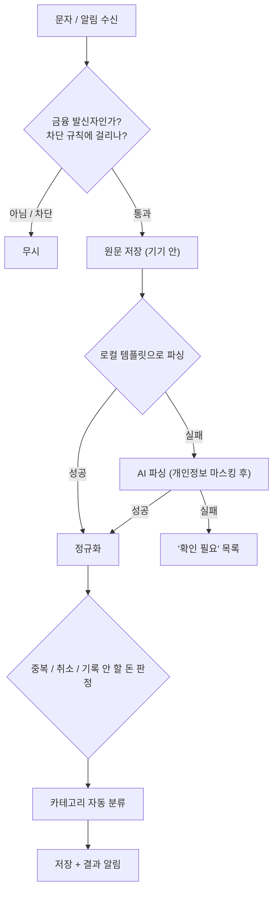
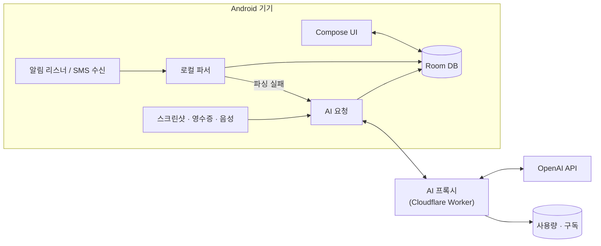

# Pocketlog 기획서 v0.1

> 작성일 2026-10-03 · 상태: 초안 · 레퍼런스: 똑똑가계부 (`reference/` 스크린샷 8장)

---

## 0. 전제 (가정)

| 항목 | 가정 | 바뀌면 생기는 영향 |
|---|---|---|
| 플랫폼 | **Android만** (✅ 결정 2026-10-03) | iOS는 만들지 않음 |
| 배포 | **플레이스토어 출시** (✅ 결정) | |
| 광고 | **출시 후 추가**, 기능 먼저 (✅ 결정) | 광고 SDK는 P2 |
| 개발 | 1인 개발 (+ Claude Code) | |
| 앱 이름 | Pocketlog (가칭) | |
| 우선순위 표기 | **P0** = MVP (내가 먼저 써보는 버전) · **P1** = v1.0 출시 (레퍼런스 기능 100%) · **P2** = 이후 확장 | |

---

## 1. 제품 정의

### 한 줄 소개
**"직접 적지 않아도 채워지는 가계부"**: 카드 문자와 알림은 자동으로 기록하고, 문자가 안 오는 결제(쿠팡머니, 페이머니, 현금 영수증)는 스크린샷 한 장으로 기록한다.

### 해결하려는 문제
1. **문자가 오는 결제**는 기존 앱도 자동으로 기록한다. 하지만 같은 결제가 두 번 잡히거나(문자 + 앱 푸시), 취소가 반영되지 않거나, 카드대금 출금까지 지출로 잡히는 문제가 생긴다.
2. **문자가 안 오는 결제**(쿠팡머니, 네이버페이 포인트, 현금)는 한 건씩 직접 입력해야 한다. **가장 큰 불편이다.**
3. 레퍼런스 앱은 기능은 많지만 표 위주의 오래된 UI라서 "이번 달 얼마 썼지?"를 한눈에 보기 어렵고, 광고도 있다.

### 성공 기준
| 지표 | 목표 |
|---|---|
| 한 달 내역 중 직접 타이핑한 비율 | **20% 이하** |
| 자동입력(문자·알림) 정확도: 금액·가맹점·결제수단 | **98% 이상** |
| 스크린샷 한 장을 저장 완료하기까지 (AI 분석 + 검토 포함) | **15초 이내** |
| 앱을 열어 이번 달 지출을 확인하기까지 | **1초** (홈 첫 화면에 표시) |

---

## 2. 레퍼런스 분석 (똑똑가계부)

**잘하는 점**: 문자·푸시 자동입력, 주/월/연 예산, 결제수단별·카테고리별·달력 보기, 할부, 잔액 관리, 3년 평균 통계, 세부 설정.

| 레퍼런스의 아쉬운 점 | Pocketlog의 개선 방향 |
|---|---|
| 상단 5탭이라 한 손으로 쓰기 불편하고, 지출과 수입이 분리돼 있음 | 하단 탭바 + 지출·수입 통합 리스트 |
| 내역 없는 날도 `₩0` 행이 쭉 나와서 스크롤이 길어짐 | 내역 있는 날만 표시, 빈 날은 달력에서 확인 (옵션으로 표시 가능) |
| 입력 화면이 가운데 뜨는 폼 다이얼로그 (키보드 전환이 많음) | 바텀시트 + 금액 키패드 먼저, 나머지는 칩으로 선택 |
| 통계가 숫자 표 위주 | 요약 카드 → 차트 → "자세히"를 누르면 표 |
| 파이차트 라벨이 서로 겹침 | 도넛 차트 + 아래에 순위 리스트 |
| 하단 광고 | 광고는 출시 후 추가하되 입력·내역 흐름을 가리지 않는 위치에만 (§9) |
| 자동입력 실패 시 "장애 신고"뿐 | 원문 보관 + AI 재분석 + 한 번 탭해서 수정 |

---

## 3. 레퍼런스 기능 매핑 (전부 포함)

레퍼런스에 있는 기능 56개 모두 들어간다. 광고와 함께 들어가는 #38 "광고 제거"만 P2이고, 나머지 55개는 **v1.0(P1)까지** 들어간다.

### 지출·수입 내역
| # | 레퍼런스 기능 | Pocketlog 구현 | 단계 |
|---|---|---|---|
| 1 | 월 이동(←/→) + 월 합계 | 내역 탭 상단 월 이동 버튼, 좌우 스와이프로도 이동 | P0 |
| 2 | 일별 그룹 리스트 + 일 합계 | 날짜 헤더에 일 합계 표시 | P0 |
| 3 | 내역 없는 날 표시 | 기본은 숨기고 달력에서 확인 (설정에서 표시 가능) | P1 |
| 4 | 항목 표시: 시간·결제수단·내역·금액 | + 카테고리 아이콘, 출처 배지(문자/알림/스샷) | P0 |
| 5 | 결제수단별 보기 | 보기 전환 칩 | P1 |
| 6 | 카테고리별 보기 | 보기 전환 칩 | P1 |
| 7 | 달력 보기 | 월 달력 + 일별 지출 강도 색상 | P0 |
| 8 | 잔여 할부금 | 리스트 하단 요약 + 자산 탭의 할부 현황 | P1 |
| 9 | 검색 | 가맹점·메모·금액 범위·기간·카테고리 필터 | P0 |
| 10 | + 추가 버튼 | 하단 중앙 (+) 버튼: 직접 입력 / 스크린샷 / 영수증 / 말로 입력 | P0 |
| 11 | 수입내역 탭 | 내역 탭 안의 세그먼트 [전체·지출·수입·이체] | P0 |
| 12 | 이번 달 수입-지출 | 홈과 내역 상단에 표시 | P0 |

### 입력
| # | 레퍼런스 기능 | Pocketlog 구현 | 단계 |
|---|---|---|---|
| 13 | 날짜·시간 | 기본값은 지금, 칩을 눌러 변경 | P0 |
| 14 | 금액 + 계산기 | 금액 키패드에 사칙연산 내장 | P0 |
| 15 | 지출내역(가맹점·내용) | 과거 입력 기반 자동완성 | P0 |
| 16 | 카테고리 대/소분류 | 2단계 칩 선택 | P0 |
| 17 | 결제수단 + 일시불/할부 | 결제수단 P0, 할부 개월 P1 (신용카드일 때만 표시) | P0/P1 |
| 18 | 메모 | | P0 |
| 19 | 즐겨찾기 | "자주 쓰는 내역" 템플릿 칩 + 최근 내역 복제 | P1 |

### 예산관리
| # | 레퍼런스 기능 | Pocketlog 구현 | 단계 |
|---|---|---|---|
| 20 | 주별·월별·연별 예산 | 월 P0, 주·연 P1. 전체 예산 + 카테고리별 예산 | P0/P1 |
| 21 | 예산 기간 이동 | | P0 |
| 22 | 금액 숨기기 (눈 아이콘, 추정) | 앱 전체의 금액을 가리는 모드 (남 앞에서 열 때) | P1 |
| 23 | "예산관리 기능이란?" 도움말 | 빈 화면에 온보딩 카드 표시 | P1 |

### 자료통계
| # | 레퍼런스 기능 | Pocketlog 구현 | 단계 |
|---|---|---|---|
| 24 | 기간 범위 지정 | 주/월/연/직접 지정 | P1 |
| 25 | 지출/수입 선택 | 토글 | P1 |
| 26 | 단위: 연/월/주/일 | | P1 |
| 27 | 대상: 전체/카테고리/결제수단 | | P1 |
| 28 | 기간별 금액 + 3년 평균 | **해당 기간을 포함한 직전 3개 기간의 이동평균, 반올림** (레퍼런스의 9개 연도 값으로 검증함: 2020년 = (2018+2019+2020)/3, 데이터가 부족한 앞쪽 연도는 있는 만큼만 평균). N 값은 설정 가능, 증감률 추가 | P1 |

### 자료차트
| # | 레퍼런스 기능 | Pocketlog 구현 | 단계 |
|---|---|---|---|
| 29 | 카테고리 비율 차트 + 총합 | 도넛 차트(가운데 총합) + 순위 리스트 | P0 |
| 30 | 지출/분류 전환 | 지출·수입 토글 | P1 |
| 31 | 카테고리별 상세 | 대분류 → 소분류 → 내역으로 이동 | P1 |
| 32 | 월별 통계 | 월별 막대 차트 + 예산선 | P0 |

### 메뉴(드로어)
| # | 레퍼런스 기능 | Pocketlog 구현 | 단계 |
|---|---|---|---|
| 33 | 계산기 | 독립 계산기 + 입력 키패드에 내장 | P1 |
| 34 | 잔액 관리 | 자산 탭: 계좌·페이머니·현금 잔액 | P1 |
| 35 | 지출 패턴 | 요일 × 시간대 히트맵, 평일·주말 비교, 자주 가는 가맹점 Top 10 | P1 |
| 36 | 도움말 | 앱 내 FAQ + 자동입력 설정 가이드 | P1 |
| 37 | 백업과 복구 | §4.10 | P0 |
| 38 | 광고 제거 | 광고는 출시 후 추가하고, 프리미엄 구독에 "광고 제거" 포함 | P2 |

### 설정
| # | 레퍼런스 기능 | Pocketlog 구현 | 단계 |
|---|---|---|---|
| 39 | 디자인 설정 (테마·글자 크기·색) | 라이트/다크/시스템, 강조색, 글자 크기 | 다크모드 P0, 나머지 P1 |
| 40 | 통화와 환율 | 기본 통화 + 해외 결제 자동 환산 | P1 |
| 41 | 카테고리 편집 (지출·수입) | 아이콘·색·순서·숨김·병합 | P0 |
| 42 | 결제수단 편집 (카드·은행) | 신용/체크/계좌/페이머니/현금 + 결제일·연결 계좌 | P0 |
| 43 | 앱 푸시 알림 자동입력 | §4.1 | P0 |
| 44 | 문자 메시지 자동입력 | P0에서는 **문자 앱 알림을 읽는 방식**으로 대응, P1에서 SMS 직접 수신 추가 (§8.5) | P0/P1 |
| 45 | 자동입력 장애 신고 | 실패한 원문은 "확인 필요"에 쌓이고, 한 번 탭하면 (마스킹된 원문으로) 신고 | P1 |
| 46 | 자동입력 방지 옵션 | 발신자·앱·키워드·금액 조건으로 차단 | P0 |
| 47 | 조작 방법 설정 | 스와이프 동작, 길게 누르기 동작, 햅틱 | P1 |
| 48 | 카테고리 자동 분류 | 사용자 규칙 → 가맹점 사전 → AI 순서, 켜고 끄기 가능 | P0 |
| 49 | 기간 시작일 (월 시작일·주 시작 요일) | 예: 월급날 25일 → 25일~다음 달 24일을 한 달로 | **P0** (모든 집계에 영향을 주므로 처음부터 넣어야 함) |
| 50 | 지출·수입 화면 세부 옵션 | 표시 항목, 빈 날 표시, 정렬 | P1 |
| 51 | 통계·차트 세부 옵션 | 이체 포함 여부, 평균 기간 N | P1 |
| 52 | 비밀번호 잠금 | PIN + 지문/얼굴 인식 | P0 |
| 53 | 데이터 관리 (백업·복구) | §4.10 | P0 |
| 54 | 데이터 초기화 | 2단계 확인 | P0 |
| 55 | 프리미엄 구독 | §9 | P1 |
| 56 | 앱 정보·문의 | | P1 |

---

## 4. 핵심 기능 상세

### 4.1 자동입력 (문자·알림)

**읽어올 수 있는 출처**
- 카드사 앱 푸시 (삼성카드, 현대카드, KB Pay 등)
- 문자 앱 알림 (삼성 메시지, Google 메시지)에 뜨는 카드 승인 문자
- 간편결제·은행 앱 푸시 (토스, 카카오페이, 카카오뱅크 등)
- (P1) SMS 직접 수신: 문자 알림을 꺼둔 경우를 위한 대비

**처리 흐름**



**추출 항목**: 유형(승인/취소/해외승인/출금/입금), 금액, 통화, 할부 개월, 일시, 가맹점, 카드·계좌 끝 4자리, 잔액·누적액

**파서 구조**
- **로컬 템플릿이 1순위**: 카드사·은행별 정규식 템플릿을 사용한다. 무료이고 오프라인에서도 즉시 처리된다. 대부분의 결제는 여기서 끝난다.
- **템플릿 원격 업데이트**: 카드사가 문자 형식을 바꿔도 앱을 업데이트하지 않고 서버 JSON만 바꿔서 대응한다.
- **AI 파싱은 2순위**: 템플릿에 없는 형식일 때만 사용한다.
- 첫 템플릿 대상은 내가 쓰는 결제수단부터: **삼성카드, KB국민체크, 토스머니, 카카오뱅크** (레퍼런스 스크린샷 기준)

**판정 규칙**: 이 부분이 정확도를 좌우한다.

> **원칙 (✅ 결정 2026-10-03): 나에게 들어오고 나가는 돈만 기록한다.** 내 계좌끼리 옮긴 돈, 카드값 출금, 페이머니 충전, 카드 선승인처럼 수입도 지출도 아닌 돈은 이체로도 남기지 않고 아예 기록하지 않는다.

| 상황 | 처리 |
|---|---|
| 같은 결제가 문자와 푸시로 2번 들어옴 | 결제수단·금액이 같고 가맹점이 비슷하며 3분 이내면 1건으로 합침 |
| 승인 취소 | 원거래를 찾아 "취소됨"으로 표시하고 통계에서 제외. 원거래를 못 찾으면 마이너스 내역으로 기록 |
| 부분 취소 | 원거래에 환불 금액 연결 |
| 카드대금 출금 | **기록하지 않음** (카드를 쓸 때 이미 지출로 잡혔으므로 이중 계산 방지) |
| **페이머니 충전** (쿠팡페이·토스·카카오페이 충전 출금) | **기록하지 않음**: 내 지갑으로 옮긴 돈. 충전 출금과 스샷 구매가 둘 다 지출로 잡혀 두 배가 되는 문제를 막음. 교통카드 충전(이즐·티머니)은 교통비로 기록 |
| 내 계좌 간 이체 | **기록하지 않음**: 받는 사람·보낸 사람이 설정의 "내 이름"과 같거나, 몇 분 안에 같은 금액이 내 다른 계좌로 들어오면 양쪽 모두 |
| 카드 선승인(가승인)과 그 취소 | **기록하지 않음**: 실제 요금은 따로 승인되어 기록됨 (카카오T 택시, 셀프 주유 등) |
| 급여·입금 | 수입 (카테고리 자동 지정) |
| 해외 승인 | 외화 금액 저장 + 원화 환산 (문자에 원화 금액이 있으면 그 값 사용) |
| 잔액·누적 정보 포함 | 자산 탭 잔액에 반영 |
| 처음 보는 카드 끝자리 | 결제수단 자동 생성 → "이 카드 이름을 정해주세요" 한 번만 물어봄 |

**저장 후 알림** (설정에서 끌 수 있음)
> 🍜 김밥천국 8,000원 · 식비로 기록했어요  [카테고리 변경] [삭제]

**확인 필요 목록**: 신뢰도가 낮거나, 파싱에 실패했거나, 중복으로 의심되는 건은 홈 상단에 배지로 모인다. 한 화면에서 스와이프로 승인하거나 수정한다.

### 4.2 AI 스크린샷 입력 ⭐ 핵심 차별점

**대표 시나리오**: 쿠팡 앱 주문목록 → 스크린샷 → 공유 → Pocketlog → 약 5초 분석 → 결과 검토 → 저장

**입력 방법**
1. **공유하기**: 다른 앱이나 갤러리에서 Pocketlog로 공유 (여러 장 가능) — P0
2. **(+) 버튼 → "스크린샷으로 추가"**: 사진 선택기 사용 (저장소 권한 불필요) — P0
3. **카메라 → 종이 영수증 촬영** — P1
4. **새 스크린샷 감지**: 앱을 열 때 "최근 스크린샷 3장, 분석할까요?" (사진 권한은 사용자가 선택) — P1

**지원하는 화면**: 쇼핑몰 주문목록·주문상세(쿠팡, 네이버, 컬리, 배민, 요기요, 무신사, 11번가, G마켓 등), 간편결제 내역(토스, 카카오페이, 네이버페이), 은행·카드 앱 거래내역, 종이 영수증, 해외 영수증(통화 자동 감지)

**처리 순서**
1. **(기기)** 이미지 해시로 이미 분석한 스크린샷인지 확인한다. 아주 긴 스크린샷은 10%씩 겹치게 세로로 나눈다. 그대로 보내면 축소되면서 글자를 못 읽게 된다.
2. **(서버 → AI)** 이미지 + 내 카테고리 목록 + 개인 규칙을 보내고, 정해진 JSON 형식으로 결과를 받는다 (§8.3).
3. **(기기) 금액 검증**: 품목 합 + 배송비 − 할인 = 결제금액인지 확인하고, 맞지 않으면 경고한다.
4. **(기기) 중복 판정**: 날짜 ±1일, 같은 금액, 같은 쇼핑몰인 기존 내역이 있으면 묻는다. 예를 들어 카드 문자로 이미 들어온 쿠팡 결제가 있는 경우다.
   → **[기존 내역에 품목만 붙이기]** (기본) / [따로 저장] / [건너뛰기]
5. **검토 화면 → 저장**
6. **학습**: 사용자가 바꾼 카테고리를 "품목 키워드 → 카테고리" 규칙으로 저장하고, 다음 요청 때 프롬프트에 함께 보낸다.

**AI 출력 형식 (JSON 스키마 요약)**
```json
{
  "source_app": "coupang",
  "document_type": "order_list | order_detail | receipt | payment_history | bank_history",
  "transactions": [
    {
      "date": "2026-10-02",
      "time": null,
      "merchant": "쿠팡",
      "total_amount": 39900,
      "currency": "KRW",
      "payment_hint": "쿠팡머니 | 쿠페이 | 삼성카드 | null",
      "status": "paid | canceled | refunded | partially_refunded",
      "order_id": "string | null",
      "items": [
        { "name": "데일리샷 와인", "quantity": 1, "amount": 29900, "category_id": "c_alcohol" }
      ],
      "shipping_fee": 1000,
      "discount": 0,
      "confidence": 0.94
    }
  ],
  "warnings": ["image_cut_off | blurry | total_mismatch"]
}
```

**결제수단 결정 규칙**: 화면에 결제수단이 보이면 그 값을 쓴다. 보이지 않으면 **"출처별 기본 결제수단"** 설정값을 쓴다 (예: 쿠팡 → 쿠팡머니). 쿠팡 주문목록에는 결제수단이 안 나오는 경우가 많아서 이 설정이 핵심이다.

**저장 방식**
- 기본: **주문 1건 + 품목별 분할**. 내역 리스트에는 "쿠팡 (3개 품목) 52,300원" 1줄로 보이고, 통계에서는 품목별 카테고리로 나뉘어 집계된다 (생활용품 9,000 / 식료품 12,400).
- 옵션: 품목별로 각각 별도 내역으로 저장
- 취소·반품된 주문은 기본으로 체크 해제

**실패 처리**
- 인식 실패 → "금액이라도 입력하기"로 직접 입력 화면 전환 (스샷은 첨부로 유지)
- 오프라인 → 대기열에 넣고 연결되면 처리한 뒤 알림

### 4.3 그 밖의 AI 기능

> 원칙: **계산으로 할 수 있는 건 AI를 쓰지 않는다.** 그래야 비용이 0이고, 즉시 처리되고, 오프라인에서도 동작한다.

| 기능 | 설명 | AI 사용 | 단계 |
|---|---|---|---|
| 카테고리 자동 분류 | 사용자 규칙 → 내장 가맹점 사전 → AI 순서. 처음 보는 가맹점만 모아서 한 번에 요청 | 일부 | P0 |
| 말로·글로 입력 | "어제 점심 김밥천국 8천원 카카오페이" → 입력 폼 자동 채움. 음성은 안드로이드 기본 음성인식 사용 | O | P1 |
| AI 월간 리포트 | 매월 1일 발송: 요약, 전월 대비 큰 변화 3가지, 예산 초과 원인, 다음 달 제안 | O | P1 |
| AI에게 묻기 | "지난 3달 배달에 얼마 썼어?" → AI가 조회 조건(JSON)을 만들고 → 기기에서 계산 → AI가 답변. **원본 내역 대신 집계 결과만 전송** | O | P2 |
| 월말 예상 지출 | 지금 속도로 쓰면 월말에 얼마가 되는지 예측 + 예산 초과 예상 알림 | X (계산) | P1 |
| 정기결제·구독 감지 | 같은 가맹점, 비슷한 금액, 월 단위 주기 → 구독 목록 | X (규칙) | P2 |
| 이상 지출 알림 | 카테고리 평균 대비 2배 이상이면 알림 | X (계산) | P2 |

### 4.4 내역
- 세그먼트 [전체·지출·수입·이체], 보기 [리스트·달력·결제수단별·카테고리별]
- 리스트 항목: `[카테고리 아이콘] 가맹점 / 시간 · 결제수단 · 출처 배지 … 금액`. 수입은 `+`와 수입 색으로 구분한다 (색만으로 구분하지 않음).
- 스와이프: 왼쪽은 삭제, 오른쪽은 복제 (조작 방법 설정에서 변경 가능)
- 길게 누르면 다중 선택 → 카테고리 일괄 변경 / 일괄 삭제
- 취소된 내역은 취소선을 긋고 통계에서 제외
- 상세 화면: 모든 필드 + **원문 보기** (문자 원문 / 스크린샷 썸네일) + 분할 품목

### 4.5 입력 (바텀시트)
- **금액을 가장 먼저** 입력한다. 커스텀 키패드에 사칙연산과 `00`, `000` 키를 넣는다.
- 그 아래는 전부 칩으로 고른다: 카테고리, 결제수단, 날짜(기본값 지금)
- 가맹점은 과거 입력 기반으로 자동완성하고, 선택하면 그때 썼던 카테고리와 결제수단까지 함께 채운다.
- 상단 "자주 쓰는" 칩: 한 번 탭하면 모든 칸이 채워진다 (레퍼런스의 즐겨찾기).
- 할부 개월은 신용카드를 골랐을 때만 표시한다.
- 저장 후 "계속 입력" 옵션 제공

### 4.6 예산
- 전체 예산 + 카테고리별 예산을 주/월/연 단위로 설정한다. 기간 시작일 설정을 따른다.
- 홈 카드: 남은 예산, **하루 권장 금액** (= 남은 예산 ÷ 남은 일수)
- 진행 바 색: 70%까지 초록 → 90%까지 주황 → 초과하면 빨강
- 알림: 50% / 80% / 100% 도달 시
- (P2) 남은 예산 이월

### 4.7 분석 (통계 · 차트 · 패턴)
- 상단: 기간 선택(주/월/연/직접 지정), 지출/수입 토글
- 요약 카드: 총액, 이전 기간 대비 증감, 일평균
- 카테고리 도넛 + 순위 리스트 (탭하면 소분류 → 내역으로 이동)
- 월별 추이 막대 차트 + 예산선
- **통계 표** (레퍼런스의 "자료통계"): 단위(연/월/주/일) × 대상(전체/카테고리/결제수단) × 금액 + N기간 이동평균 + 증감률
- **지출 패턴**: 요일 × 시간대 히트맵, 평일 vs 주말, 자주 가는 가맹점 Top 10
- 결제수단별 사용액 (카드 실적 확인용)

### 4.8 자산 (잔액 · 할부)
- 계좌, 카드, 페이머니, 현금 목록과 잔액
- 잔액 자동 갱신: 계좌·체크카드는 문자에 있는 잔액 정보로, 페이머니는 충전(+)과 사용(−)으로 계산
- 잔액을 직접 보정할 수 있음
- 신용카드: 이번 달 결제 예정액 (결제일·이용기간 설정 기반), 할부 현황 (남은 회차와 금액)
- (P2) 순자산 합계

### 4.9 설정 구성
```
기본        디자인 · 통화와 환율 · 카테고리 편집 · 결제수단 편집 · 기간 시작일
자동입력    알림 자동입력 · 문자 자동입력 · 차단 규칙 · 출처별 기본 결제수단 · 장애 신고
AI          카테고리 자동 분류 · 스크린샷 분석 설정 · 월간 리포트 · AI 데이터 사용 안내
화면        내역 화면 옵션 · 통계·차트 옵션 · 조작 방법
보안        앱 잠금(PIN·생체인증) · 금액 가리기 · 최근 앱 화면 가리기
데이터      백업·복구 · 내보내기(CSV·엑셀) · 다른 앱에서 가져오기 · 초기화
정보        프리미엄 · 도움말 · 문의 · 버전
```

### 4.10 보안 · 백업
- **앱 잠금**: PIN 4~6자리 + 지문·얼굴 인식, 백그라운드로 전환하고 N분이 지나면 잠금
- **금액 가리기 모드**, **최근 앱 화면 가리기** (옵션)
- **백업**
  1. 안드로이드 자동 백업 (구글 드라이브, 사용자 설정 불필요) — P0
  2. 암호화된 백업 파일 내보내기·가져오기 — P0
  3. CSV·엑셀 내보내기 — P1
  4. (P2) 클라우드 동기화 (여러 기기 사용)
- **똑똑가계부 데이터 가져오기** — P1: 2018년부터 쌓인 내역이 있어야 3년 평균과 장기 통계가 의미가 있다. 똑똑가계부의 내보내기 파일 형식은 확인이 필요하다 (§13).

---

## 5. 정보 구조 & 화면

### 하단 탭
```
 홈      내역     ( + )     분석     자산
```
설정은 홈 오른쪽 위 ⚙ 버튼으로 들어간다.

### 화면 목록
| ID | 화면 | 내용 |
|---|---|---|
| S01 | 온보딩 | 소개 3장 → 알림 접근 권한 안내 → 결제수단 등록 → 기간 시작일 |
| S02 | 홈 | 이번 달 요약, 예산, 확인 필요, AI 한마디, 최근 내역 |
| S03 | 내역 | 리스트 / 달력 / 결제수단별 / 카테고리별 |
| S04 | 내역 상세 | 필드 수정, 원문 보기, 분할 품목 |
| S05 | 입력 시트 | 금액 키패드 + 칩 |
| S06 | 스크린샷 분석 중 → 검토 | §4.2 |
| S07 | 확인 필요함 | 자동입력 검토 대기 목록 |
| S08 | 분석 | 차트 / 통계 표 / 지출 패턴 |
| S09 | 예산 | 주/월/연, 카테고리별 |
| S10 | 자산 | 잔액, 카드 결제 예정액, 할부 |
| S11 | 검색 | 필터 |
| S12 | 설정 + 하위 화면들 | §4.9 |
| S13 | 계산기 | |
| S14 | AI 월간 리포트 | |

### 와이어프레임 (주요 화면)

**S02 홈**
```
10월                                   🔔  ⚙

이번 달 쓴 돈
1,234,500원
지난달 이맘때보다 82,000원 덜 썼어요

[ 예산 ]  ███████░░░  68%
남은 565,500원 · 오늘은 20,900원까지 괜찮아요

[ 확인 필요 2건 ]  자동입력 검토하기          >

[ AI ]  이번 주 배달이 평소보다 42% 많아요

최근 내역                                전체 >
🍜 김밥천국 · 삼성카드                -8,000
🛒 쿠팡 (3개 품목) · 쿠팡머니        -52,300
💰 급여 · 카카오뱅크              +3,200,000
──────────────────────────────────────────────
 홈       내역      ( + )      분석      자산
```

**S03 내역 (리스트)**
```
←   2026년 10월   →                        🔍
지출 46,400 · 수입 0 · 남은 돈 -46,400
[전체] [지출] [수입] [이체]        보기: 리스트 ▾

10월 2일 (금)                           -42,450
🎁 앨리스프랜즈     19:43 · 삼성카드      -1,000
🍷 (주)데일리샷     19:30 · KB국민체크   -39,900
🚇 지하철  [알림]   18:50 · 토스머니      -1,550

10월 1일 (목)                            -3,950
🏪 CU 자양승일점    19:25 · 삼성카드      -2,400
🚇 지하철  [알림]   18:48 · 토스머니      -1,550

잔여 할부금                                  0원
```

**S05 입력 시트**
```
자주 쓰는:  [☕ 스벅 아아] [🚇 지하철] [🍱 점심]
──────────────────────────────────────────────
                 12,000원
            가맹점 (자동완성)
[🍚 식비 › 점심]  [💳 삼성카드 · 일시불]  [📅 오늘 11:11]
메모
──────────────────────────────────────────────
    7       8       9       ÷
    4       5       6       ×
    1       2       3       −
   00       0       ⌫       +
[📷 스샷] [🧾 영수증] [🎙 말로]          [ 저장 ]
```

**S06 스크린샷 검토**
```
←  스크린샷 분석 결과                     쿠팡
주문 3건을 찾았어요

☑ 10월 2일 · 쿠팡머니(기본값)          39,900
   ├ 데일리샷 와인 ×1     🍷 술·음료   29,900
   ├ 키친타월 6롤 ×1      🧻 생활용품   9,000
   └ 배송비                             1,000

☑ 10월 1일                             12,400
   └ 생수 2L ×12          🛒 식료품    12,400
   ⚠ 이미 있는 내역과 같아 보여요
     10/1 삼성카드 · 쿠팡 12,400원
     ( 기존 내역에 품목만 붙이기 ▾ )

☐ 9월 28일 · 반품 완료                  8,900

     [ 저장하기 · 새 내역 1건 + 품목 연결 1건 ]
```

---

## 6. 디자인 가이드

### 원칙
1. **숫자가 주인공**: 금액은 크게, 나머지는 조용하게
2. **한 손 조작**: 주요 버튼은 화면 아래쪽 절반에 둔다
3. **입력은 3번 탭 이내**
4. **자동으로 기록된 건 티가 나게** (출처 배지), **확인할 건 한곳에** (확인 필요 목록)
5. **빨간색은 정말 경고할 때만**: 지출을 전부 빨간색으로 표시하면 스트레스를 준다. 지출은 기본 글자색, 예산 초과만 빨간색으로 한다.

### 컬러 토큰 (라이트 / 다크)
| 토큰 | 라이트 | 다크 | 용도 |
|---|---|---|---|
| `bg` | `#FFFFFF` | `#0F1115` | 배경 |
| `surface` | `#F4F5F7` | `#1A1D23` | 카드, 시트 |
| `text` | `#111318` | `#F2F3F5` | 본문, **지출 금액** |
| `text-sub` | `#6B7280` | `#9CA3AF` | 보조 텍스트 |
| `brand` | `#4C5BF5` | `#7C87FF` | 주요 버튼, 선택 상태 |
| `income` | `#12B886` | `#38D9A9` | 수입 금액 |
| `warn` | `#FF9F1C` | `#FFB347` | 예산 80% 이상 |
| `danger` | `#F04452` | `#FF6B76` | 예산 초과, 삭제 |

- 카테고리 차트용 색 8개는 색각이상자도 구분할 수 있는 조합으로 따로 정한다.
- 옵션: Material You 다이내믹 컬러 (배경화면에 따라 강조색 변경)

### 타이포그래피
- **Pretendard** (한글·숫자 모두 깔끔한 무료 폰트)
- **숫자는 고정폭 숫자(tabular figures)** 로 표시한다. 금액이 세로로 정렬되고, 값이 바뀔 때 글자가 흔들리지 않는다.
- 크기 단계: Display 32 Bold (홈 금액) · Title 20 SemiBold · Body 16 · Caption 13
- 시스템 글자 크기 설정을 따르고, 앱 안에서 한 번 더 조정할 수 있다.

### 컴포넌트 & 모션
- 카드 모서리 20dp, 리스트 항목 높이 64dp, 카테고리 아이콘은 둥근 파스텔 배경
- 입력·필터·선택은 전부 **바텀시트**로 (중앙 다이얼로그는 쓰지 않음)
- 금액 카운트업 애니메이션, 저장 시 햅틱 + 체크 표시
- 스크린샷 분석 중에는 스켈레톤과 진행 문구 표시 ("주문 3건 찾는 중…")
- **다크모드 P0**, **홈 화면 위젯 P1** (2×2 이번 달 지출 / 4×2 남은 예산 + 빠른 입력 버튼)

### 접근성
- 색만으로 의미를 전달하지 않는다 (수입에 `+` 표시, 예산 초과에 아이콘 추가)
- TalkBack 라벨, 터치 영역 최소 48dp

---

## 7. 데이터 모델

**원칙**
- **금액은 원 단위 정수(Long)로 저장하고 Float는 쓰지 않는다.** 소수 오차로 합계가 1원씩 틀어지는 걸 막는다.
- 외화는 원래 금액 + 통화 + 원화 환산 금액(당시 환율)을 함께 저장한다.
- 삭제는 소프트 삭제(`deleted_at`)로 처리해서 동기화와 실행 취소에 대비한다.

```
Transaction            내역
  id, type             EXPENSE | INCOME | TRANSFER
  amount               Long (KRW)
  original_amount?, currency
  occurred_at          일시 (타임존 포함)
  merchant, memo
  category_id?         분할이 없을 때 사용
  payment_method_id    출금 쪽
  to_payment_method_id?  이체 대상 (예: 계좌 → 쿠팡머니)
  installment_months   0 = 일시불
  status               CONFIRMED | PENDING_REVIEW | CANCELED
  source               MANUAL | SMS | PUSH | SCREENSHOT | RECEIPT | VOICE | IMPORT
  raw_ref?             RawMessage 또는 ScanJob 참조
  exclude_from_stats
  created_at, updated_at, deleted_at

TransactionSplit       분할 품목 (스크린샷 품목 등)
  id, transaction_id, name, quantity, amount, category_id

Category               id, type, name, icon, color, parent_id?, sort, hidden
PaymentMethod          결제수단 겸 자산
  id, kind             CREDIT | CHECK | BANK | PAY_MONEY | CASH
  name, issuer, last4, aliases[]
  balance?             카드는 null
  linked_account_id?   체크카드 → 계좌
  billing_day?, statement_start_day?
Budget                 id, period (WEEK|MONTH|YEAR), amount, category_id?
Favorite               id, name, template(JSON)
Rule                   id, kind (CATEGORY | BLOCK | SOURCE_DEFAULT_PAYMENT), pattern, value
RawMessage             id, channel (SMS|PUSH), sender, body, received_at, parse_status, transaction_id?
ScanJob                id, image_hash, status, result_json, created_at
설정                    DataStore (key-value)
```

> 통계는 `TransactionSplit`이 있으면 분할 품목 기준으로, 없으면 `Transaction.category_id` 기준으로 집계한다. `TRANSFER`와 `CANCELED`는 기본적으로 제외한다.

---

## 8. 기술 설계

### 8.1 기술 스택
| 영역 | 선택 | 이유 |
|---|---|---|
| 언어·UI | **Kotlin + Jetpack Compose + Material 3** | 알림 리스너, SMS, 위젯처럼 핵심 기능이 전부 안드로이드 네이티브 기능 |
| 로컬 DB | Room (SQLite) | 오프라인 우선, 집계 쿼리 |
| 설정 저장 | SharedPreferences | 설정 값 몇 개라 플랫폼 기본 기능으로 충분 |
| 백그라운드 작업 | WorkManager (P1, 오프라인 AI 대기열이 필요해질 때) | MVP는 실패 시 "확인 필요"로 넘김 |
| 차트 | Compose Canvas로 직접 (도넛·막대·히트맵) | 차트 3종이라 라이브러리보다 짧고 디자인을 그대로 맞출 수 있음 |
| 위젯 | Jetpack Glance | |
| 이미지 선택 | Android Photo Picker | 저장소 권한 불필요 |
| 생체인증 | androidx.biometric | |
| 결제 | Google Play Billing | |
| 서버 | **Cloudflare Workers** (이미 쓰고 있는 wrangler) | MVP는 AI 프록시만. P1에 사용량 제한(KV/D1)과 구독 확인 추가 |
| AI | **OpenAI API** (비전 + 구조화 출력) | §8.3 |
| 크래시 수집 | Firebase Crashlytics | 금융 데이터는 보내지 않음 |

### 8.2 구조

- **내역 데이터는 기기에만 저장한다.** 서버는 AI 호출 중계와 사용량·구독 관리만 맡는다.
- **API 키는 서버에만 둔다.** APK에 넣으면 디컴파일로 탈취된다.

### 8.3 AI 호출 설계
| 항목 | 내용 |
|---|---|
| 모델 | `gpt-5.5` (기본값. 다른 모델로 바꿀지는 §13에서 결정) |
| 출력 | **구조화 출력** (`response_format`에 JSON 스키마, `strict: true`): 형식이 틀려서 파싱에 실패하는 일이 없음 |
| 사고 깊이 | `reasoning_effort: low`부터 시작 (단순 추출은 깊은 추론이 필요 없음). 평가셋으로 조정 |
| 이미지 | `detail: high`로 보냄. 쇼핑 앱 글씨가 작으므로 원본 해상도를 유지하고, 아주 긴 스크린샷만 나눠서 보냄 |
| 프롬프트 | 고정 시스템 프롬프트(역할·규칙·스키마, 프롬프트 캐싱 대상) + 내 카테고리 목록 + 개인 규칙 상위 N개 + 이미지 |
| 거절 대응 | 응답의 `refusal`을 확인해서 앱에 "분석할 수 없는 이미지"로 알림 |
| 사용량 제한 | 서버에서 사용자별 월 사용량 확인 (§9) |
| **평가셋** | 실제 스크린샷 30~50장 + 정답 JSON을 만들어 두고, 모델·effort·해상도를 바꿀 때마다 정확도와 건당 비용을 측정 |

### 8.4 개인정보 처리
- 문자 원문을 AI로 보낼 때는 **이름(홍\*동), 카드번호, 잔액을 마스킹**한 뒤 보낸다.
- 스크린샷은 **서버에 저장하지 않는다**. 메모리에서 처리한 뒤 바로 폐기한다.
- AI를 처음 쓸 때 동의 화면에서 "어떤 데이터가 어디로 가는지" 한 장으로 안내한다.
- 출시할 때 개인정보처리방침이 필수다.
- 기기 저장소는 OS가 기본으로 암호화한다. DB 자체 암호화(SQLCipher)는 P2.

### 8.5 안드로이드 권한 · 정책
| 권한 | 용도 | 주의할 점 |
|---|---|---|
| 알림 접근 (`NotificationListenerService`) | 카드·페이 앱 푸시 + **문자 앱 알림** | 사용자가 설정 화면에서 직접 켜야 함 → 온보딩에서 딥링크로 안내. 삼성 메시지의 "알림에 내용 표시"가 꺼져 있으면 읽을 수 없음 |
| SMS 수신 (`RECEIVE_SMS`) | 문자 직접 수신 (P1) | **구글 플레이는 기본 문자 앱이 아닌 앱의 SMS 권한을 심사함** (권한 선언 양식 제출). 금융 관리 용도 예외가 있지만 반려될 위험이 있어서 **MVP는 알림 접근만으로 시작** |
| 알림 표시 | 저장 결과·예산 알림 | Android 13 이상은 런타임 권한 |
| 사진 (선택) | 새 스크린샷 감지 (P1) | 사진 선택기·공유하기로 들어오는 경로는 권한 불필요 |
| 배터리 최적화 제외 | 리스너 안정성 | 일부 제조사(삼성 등)가 백그라운드 앱을 종료함 → 가이드 + 앱 시작 시 리스너 재연결 |

> 개발 중 APK를 직접 설치하면, Android 13 이상에서는 알림 접근을 켜기 전에 앱 정보 → **"제한된 설정 허용"** 을 먼저 해야 한다.

---

## 9. 비용 & 수익 모델

### AI 건당 비용 추정
(2026-10 기준 단가: `gpt-5.5` 입력 $5 / 출력 $30 per 1M 토큰, 1달러 = 1,400원으로 가정. 2026-10-03 실측은 표에 "실측"으로 표시)

| 작업 | 입력 토큰 | 출력 토큰 | 건당 비용 |
|---|---|---|---|
| 스크린샷 1장 (실측: 내역 화면, 거래 7건) | 2,323 | 683 | **약 $0.032 (약 45원)**. 품목이 많으면 출력이 늘어 60원 안팎 |
| 문자 AI 파싱 (템플릿 실패 시에만, 실측) | 453 | 137 | 약 $0.006 (약 9원) |
| 카테고리 분류 (가맹점 20개 묶음) | 약 1,500 | 약 400 | 약 $0.02 (약 27원) |
| 월간 리포트 | 약 5,000 (집계 데이터) | 약 1,500 | 약 $0.07 (약 100원) |

- 보통 사용자 (스크린샷 월 20장): **월 약 1,200원**
- 많이 쓰는 사용자 (월 60장): **월 약 3,000원**
- 쇼핑 앱의 긴 스크린샷으로 평가셋을 만들 때 다시 측정한다.
- 비용을 줄이는 방법: ① 시스템 프롬프트 캐싱 ② 이미지 해상도 조정 ③ 저가 모델 전환. 단, 저가 모델은 **평가셋으로 정확도를 확인한 뒤에** 결정한다 (§13).

### 요금제 (제안)
| | 무료 | 프리미엄 (월 3,900원 / 연 33,000원) |
|---|---|---|
| 기본 가계부 · 통계 · 예산 · 잠금 · 백업 | ✅ | ✅ |
| 문자·알림 자동입력 (로컬 파서) | ✅ 무제한 | ✅ 무제한 |
| AI 스크린샷 · 영수증 | 월 5장 | 월 60장 (초과하면 추가 구매) |
| 말로 입력 · AI 월간 리포트 | 간단 버전 | ✅ |
| AI에게 묻기 · 클라우드 동기화 (P2) | | ✅ |
| 광고 (출시 후 추가) | 있음 | 없음 |

---

## 10. 로드맵

> 진행 현황 (2026-10-03): 0단계 완료, 1단계(MVP) 코드 완성. 실제 폰 확인 전이에요. 세부 내용은 [README.md](README.md).

| 단계 | 기간 (대략) | 포함 내용 | 끝나는 기준 |
|---|---|---|---|
| **0. 기반** | 1주 | 프로젝트 세팅, 디자인 토큰·공통 컴포넌트, DB 스키마, 기간 시작일 로직 | 빈 앱에서 다크모드와 탭 전환이 동작 |
| **1. MVP (P0)** | 5주 | 직접 입력, 내역(리스트·달력·검색), 카테고리·결제수단 편집, **알림 자동입력 + 내 카드 템플릿 + 중복·취소·이체 판정**, **AI 스크린샷 입력 (쿠팡 우선)**, 카테고리 자동 분류, 월 예산, 홈, 차트 2종, 잠금, 백업·초기화 | **내 폰에서 2주 동안 실사용**하며 성공 기준(§1) 측정 |
| **2. v1.0 (P1)** | 5주 | 나머지 레퍼런스 기능 전부 (통계 표, 지출 패턴, 자산·할부, 주·연 예산, 위젯, 계산기, 통화, 세부 설정), SMS 수신, 말로 입력, AI 리포트, 영수증, 똑똑가계부 가져오기, 서버 사용량 제한, 구독 결제, 스토어 심사 | 플레이스토어 출시 |
| **3. 확장 (P2)** | - | 광고 + 광고 제거, AI에게 묻기, 구독 감지, 이상 지출 알림, 클라우드 동기화 | |

---

## 11. 리스크

| 리스크 | 대응 |
|---|---|
| 카드사가 문자 형식을 변경 | 템플릿 원격 업데이트 + AI 파싱 + 장애 신고 데이터로 빠르게 수정 |
| 구글 플레이 SMS 권한 반려 | MVP는 알림 접근만 사용. SMS는 선택 기능으로 분리 |
| OS 업데이트로 알림 읽기 동작이 바뀜 (예: Android 15부터 인증번호 알림 내용 가림) | 승인 문자는 해당되지 않지만, OS 업데이트마다 회귀 테스트 |
| AI가 금액을 잘못 읽음 | **반드시 검토 화면을 거쳐 저장**, 금액 합계 검증, 신뢰도 낮은 칸 강조 |
| AI 비용 폭주 (악용) | 서버에서 사용자별 사용량 제한, 이미지 해시로 중복 분석 차단 |
| 이중 계산 (충전·카드대금·문자+푸시) | §4.1 판정 규칙(수입·지출이 아닌 돈은 기록 안 함) + 단위 테스트 |
| 개인정보 | 기기 내 저장, 마스킹, 스크린샷 서버 미저장, 동의 화면 |

---

## 12. 측정할 것 (출시 후)
- 자동입력 성공률 (출처별), "확인 필요"로 넘어가는 비율
- 스크린샷 분석 성공률, 사용자가 결과를 고친 비율 (필드별)
- 직접 입력 비율
- 건당 AI 비용, 사용자당 월 AI 비용

---

## 13. 결정이 필요한 것

| # | 질문 | 현재 가정 |
|---|---|---|
| 1 | iOS도 필요한가? | ✅ 결정: Android만 |
| 2 | 나만 쓰는 앱인가, 스토어에 출시하는가? | ✅ 결정: 스토어 출시 |
| 3 | 광고를 넣을 것인가? (레퍼런스의 "광고 제거") | ✅ 결정: 넣는다. 단 기능을 먼저 만들고 출시 후 추가 |
| 4 | AI 모델 | ✅ 결정: OpenAI (2026-10-03). `gpt-5.5`로 시작. 평가셋에서 `gpt-5.6-terra`($2/$12)나 `gpt-5.4-mini`($0.75/$4.5)도 정확도가 충분하면 전환해서 비용을 줄일지 결정 |
| 5 | 여러 기기 동기화 / 가족과 함께 쓰는 공유 가계부 | 범위 밖 (P2 동기화만) |
| 6 | 똑똑가계부 기존 데이터 이전 | 필요하다고 가정. **내보내기 파일 샘플이 있어야 형식 확인 가능** |
| 7 | 앱 이름 | Pocketlog (가칭) |
